# pinEAPol

[](LICENSE)
[](https://hak5.org/)

Pager-native WPA-Enterprise assessment with controlled EAP negotiation,
persistent evidence, and a verified hostapd-mana backend.

> [!WARNING]
> Use pinEAPol only on networks and devices covered by explicit written
> authorization. It handles sensitive authentication material; protect retained
> sessions and follow the engagement's interception, privacy, and disclosure
> requirements.

- **Type:** User payload
- **Category:** Capture
- **Author:** R4g3D
- **Version:** 3.6

## What is pinEAPol?

pinEAPol is a WiFi Pineapple Pager payload for authorized WPA-Enterprise
assessment. It discovers an advertised enterprise network—or accepts an SSID
and channel manually—then deploys a configurable test access point using
[hostapd-mana](https://github.com/sensepost/hostapd-mana)'s built-in EAP server
and WPE credential writer.

The payload records the parts of the EAP exchange that are useful during an
assessment: identities, negotiated methods, plaintext exposed through GTC or
PAP, CHAP material, MSCHAPv2 challenge-response data, raw hostapd diagnostics,
and an optional EAPOL packet capture. Each run is stored as a separate,
persistent engagement session under `/root/loot/pineapol/`.

The supplied password verifier is intentionally a dummy account. Unknown
credentials normally fail authentication, but supported methods can still emit
capture material before that expected failure. pinEAPol does not claim that an
arbitrary password will authenticate successfully.

## Documentation map

- [Install and start](#installation)
- [Follow the Pager workflow](#pager-walkthrough)
- [Understand capture results](#what-can-pineapol-capture)
- [Find engagement evidence](#session-output)
- [Verify the payload](#verification)
- [Troubleshoot a session](#troubleshooting)

## Key capabilities

### Assessment workflow

- Automatic discovery of advertised WPA-Enterprise networks, with manual
  SSID/channel entry as a fallback.
- Broad automatic EAP negotiation plus focused PEAP, TTLS, TLS, FAST, and MD5
  profiles.
- Named certificate profiles that can be reused, edited, regenerated, and
  renewed when nearing expiry.
- A complete pre-deployment review with options to change the EAP profile,
  certificate, or client-reconnection choice before any radio changes occur.
- Optional, disabled-by-default broadcast deauthentication for an explicitly
  discovered BSSID. Manual targets cannot request it because no BSSID is known.

### Evidence and resilience

- Persistent per-session logs, captures, parsed results, configuration, and
  certificate fingerprints; pinEAPol does not use `/tmp` for its own data.
- Live detection of identities, GTC/PAP values, and complete MANA MSCHAPv2
  Hashcat events without repeatedly parsing the entire debug log.
- Atomic result publication, per-station EAP event timelines, raw
  `hostapd -ddd -K` logging, and optional EAPOL PCAP retention.
- Crash-safe cleanup, an exclusive-run lock, and ownership validation that
  prevents pinEAPol from terminating the Pager's system hostapd.

### Backend integrity

- Bundled and pinned `mipsel_24kc` hostapd-mana backend with SHA-256 and runtime
  feature validation.
- Persistent backend reuse without replacing the system hostapd/wpad package.
- BusyBox-compatible parsing and repository-side regression fixtures.

## What can pinEAPol capture?

The selected profile controls which methods the test AP offers. The client still
chooses whether to connect, whether to trust the presented certificate, and
which compatible method to use.

| Profile | Expected assessment evidence | Plaintext password expected? |
|---|---|---|
| Broad / automatic | Method negotiation plus the strongest evidence emitted by any outer or inner method enabled in the bundled MANA build | Depends on the selected inner method |
| PEAP + MSCHAPv2 | Identity and MSCHAPv2 challenge-response in Hashcat mode 5500 form | No |
| PEAP + GTC | Identity and a possible GTC response | Possible |
| TTLS + PAP | Identity and a possible PAP username/password record | Possible |
| TTLS + CHAP | Identity and a legacy CHAP challenge-response | No |
| TTLS + MSCHAPv1 | Identity and a legacy MSCHAPv1 challenge-response | No |
| TTLS + MSCHAPv2 | Identity and MSCHAPv2 challenge-response | No |
| EAP-TLS | Client-certificate negotiation and TLS diagnostics | No password is exchanged |
| EAP-TLS + accept client certificate | Client-certificate negotiation while accepting the presented certificate | No password is exchanged |
| FAST + MSCHAPv2/GTC | MSCHAPv2 material or a possible GTC response | Method-dependent |
| EAP-MD5 | Legacy challenge-response material | No |

pinEAPol enables MANA WPE only. Karma probe responses and forced EAP success
remain disabled. Accept-any-client-certificate behavior is available only in the
explicit **EAP-TLS [accept client cert]** profile; it is not part of the broad
profile. A client that correctly rejects the assessment certificate may provide
only limited negotiation evidence.

## Requirements and compatibility

The bundled backend was built for the WiFi Pineapple Pager firmware target
`ramips/mt76x8`, architecture `mipsel_24kc`, using the OpenWrt 24.10.1 SDK. It is
not a general-purpose hostapd-mana binary for other Pineapple models or CPU
architectures.

Required on the Pager:

- Bash, because the payload uses arrays, local variables, and here-strings.
- `openssl`, supplied by `openssl-util`.
- `iw` and `ifconfig`.
- `iwinfo` for automatic enterprise-network discovery. Manual SSID/channel
  entry remains available when discovery returns no results.
- A radio that advertises AP mode. pinEAPol prefers `phy1` and falls back to
  `phy0`.
- The complete payload directory, including
  `bin/hostapd-mana-mipsel_24kc`.

`tcpdump` is optional and enables the EAPOL PCAP. `opkg` and network access are
needed only if pinEAPol offers to install a missing command dependency.

The bundled binary was built from hostapd-mana commit
`785ced85088725913df1202b85a99ac3724caa4b`. Its expected SHA-256 is
`0c1c6b332ba13e1c2b07b3375b5de4c5f8390ce9a6f092152795ef0477a8c2b7`.

## Installation

From a clone of this repository, copy the complete payload directory to the
Pager's persistent storage:

```sh
mkdir -p /mmc/root/payloads/user/capture
cp -r payloads/user/capture/pineapol /mmc/root/payloads/user/capture/
chmod +x /mmc/root/payloads/user/capture/pineapol/payload.sh
```

Do not copy `payload.sh` by itself: backend validation requires the bundled
`bin/` directory and its checksum/build metadata. The installed directory and
loot namespace are named `pineapol`, while the payload appears as **pinEAPol**
in the Pager UI.

pinEAPol checks its command dependencies at launch and can offer to install
missing packages with `opkg`. It never installs over the system hostapd/wpad
service.

## Quick start

1. Launch **Capture > pinEAPol** from the Pager payload menu.
2. Read the authorization warning and confirm that the engagement is in scope.
3. Select a discovered WPA-Enterprise target, or use manual entry for an SSID
   and channel that is not advertised.
4. Choose the EAP profile that matches the evidence you are authorized to test.
5. Select or create a certificate profile.
6. Leave client reconnection disabled unless the engagement explicitly permits
   a deauthentication burst against the selected BSSID.
7. Review the complete configuration and choose **Deploy**.
8. Watch the live identity and capture counters. Press a Pager button when you
   are ready to stop and harvest the session.
9. Retrieve the report and supporting evidence from
   `/root/loot/pineapol/current/`.

## Pager walkthrough

### 1. Launch confirmation

Launch pinEAPol from **Capture** in the Pager payload menu. The start screen
explains that the payload will deploy a hostapd-mana WPA-Enterprise test AP and
displays the authorized-testing warning. Confirm to continue or cancel before
any radio or authentication work begins.

<p align="center">
  
</p>

<p align="center"><em>Launching pinEAPol from the WiFi Pineapple Pager payload menu.</em></p>

<p align="center">
  
  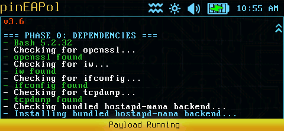
</p>

<p align="center"><em>The start confirmation and Phase 0 dependency and runtime validation.</em></p>

### 2. Target selection

Choose whether to scan for advertised WPA-Enterprise networks or enter a target
manually. Discovered targets retain their BSSID and signal information; when an
SSID is advertised by multiple APs, pinEAPol presents the matching BSSIDs for
selection. A scan with no enterprise results offers a rescan or manual entry.
Manual targets require only an SSID and channel, so they do not enable
deauthentication.

<p align="center">
  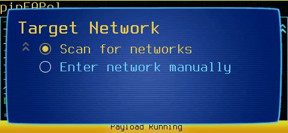
  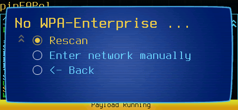
</p>

<p align="center"><em>Selecting a target workflow and the fallback when no enterprise networks are discovered.</em></p>

<p align="center">
  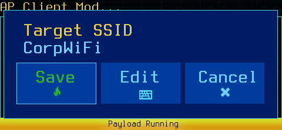
  
</p>

<p align="center"><em>Manual target entry: first the SSID, then its channel.</em></p>

### 3. EAP profile

The EAP Profile list offers broad automatic negotiation and focused profiles.
The focused choices make assessment intent explicit—for example,
**PEAP + MSCHAPv2 [hash]**, **TTLS + PAP [cleartext]**, or
**EAP-TLS [certificate]**. The built-in help entry summarizes the expected
evidence before selection.

<p align="center">
  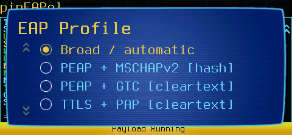
</p>

<p align="center"><em>Selecting a broad or focused EAP profile for the test AP.</em></p>

### 4. Certificate profile

Choose an existing named certificate profile or create a new one. Existing
profiles can be used unchanged, edited, or forced to regenerate. New profiles
can customize names, organization fields, SANs, validity, and key sizes. A
valid, unchanged certificate is reused until it reaches the renewal threshold.

<p align="center">
  
  
</p>

<p align="center"><em>Selecting a certificate profile and choosing whether a new profile uses defaults or custom values.</em></p>

When creating a custom profile, pinEAPol collects the CA and server names,
organization details, country and locality, DNS/IP SANs, certificate validity,
and RSA key size directly on the Pager.

| CA and server names | Organization details |
|---|---|
| 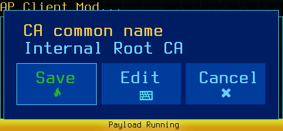 | 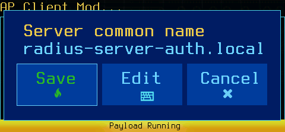 |
| 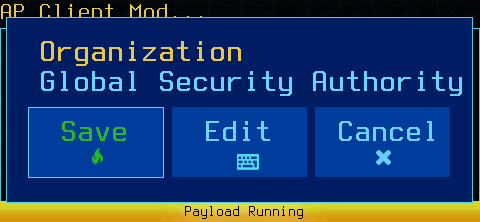 | 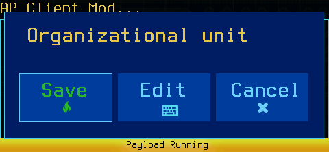 |

| Location and SANs | Certificate lifetime and key |
|---|---|
|  |  |
|  | 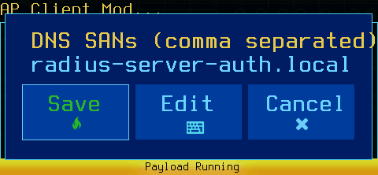 |
| 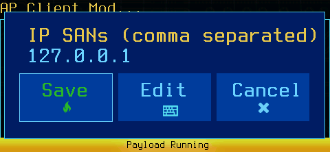 |  |
| 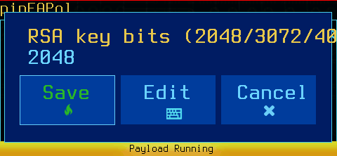 | |

### 5. Client reconnection

For a discovered BSSID, the Client Reconnection screen defaults to
**Skip deauthentication**. If the assessment scope permits active client
reconnection, select **Send deauthentication burst** and choose the packet
count. This option is deliberately unavailable for manually entered targets.

### 6. Review setup

Before certificate generation, interface creation, or AP deployment, pinEAPol
shows the target, channel, EAP profile, certificate profile, backend, and
deauthentication state. Choose **Deploy**, change any individual choice, or
cancel without modifying the radio.

<p align="center">
  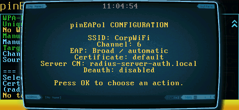
  
</p>

<p align="center"><em>The configuration summary and review menu before deployment.</em></p>

Once deployed, pinEAPol generates or reuses the selected certificate material,
prepares its virtual AP interface, and starts the bundled hostapd-mana backend.

<p align="center">
  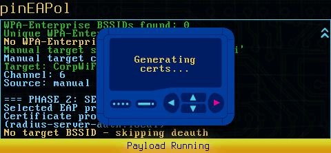
</p>

<p align="center"><em>Generating the selected certificate profile during Phase 2 setup.</em></p>

### 7. Live capture

During deployment, the Pager reports newly observed identities, negotiated
methods, complete MSCHAPv2 responses, possible GTC/PAP plaintext, authentication
outcomes, and periodic counters. Capture events trigger Pager feedback. The raw
debug log remains available even when a record cannot be promoted into a parsed
result.

<p align="center">
  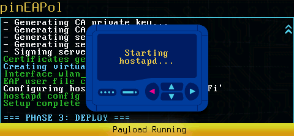
  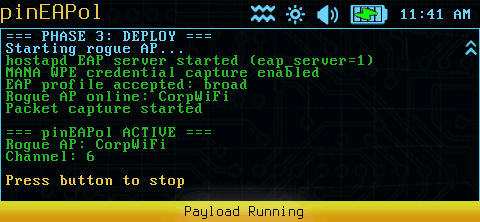
</p>

<p align="center"><em>Starting hostapd-mana and the resulting Phase 3 deployment output.</em></p>

<p align="center">
  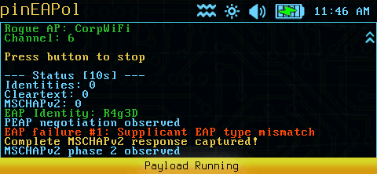
</p>

<p align="center"><em>A live MSCHAPv2 challenge-response capture reported on the Pager.</em></p>

### 8. Stop and harvest

Press a Pager button to request an orderly stop. pinEAPol flushes hostapd and
tcpdump, removes only its managed virtual interface, performs the final parse,
and displays counts for identities, plaintext records, and MSCHAPv2 captures.
When nothing was parsed, the completion dialog still points to the retained raw
session logs.

<p align="center">
  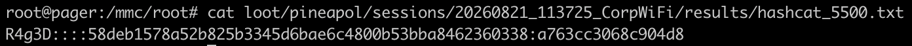
</p>

<p align="center"><em>The captured MSCHAPv2 record retained in persistent pinEAPol session loot.</em></p>

## Persistent layout

```text
/root/loot/pineapol/
├── config/
│   ├── pineapol.conf
│   └── eap-profiles/
├── bin/
│   ├── mana-<source-commit>/
│   │   ├── hostapd
│   │   └── manifest
│   ├── mana-current -> mana-<source-commit>/
│   └── mana-current.manifest
├── certificates/
│   └── <profile>/
├── sessions/
│   └── <timestamp>_<ssid>/
│       ├── config/
│       ├── logs/
│       ├── captures/
│       ├── results/
│       └── work/
├── run/
│   ├── lock/                         # present only while a run owns the lock
│   ├── hostapd.pid
│   ├── hostapd.start
│   ├── hostapd.config
│   ├── tcpdump.pid
│   └── tcpdump.start
└── current -> sessions/<latest-session>/
```

pinEAPol starts with `umask 077`. Persistent settings, private keys, cached
binaries, logs, and parsed results receive restrictive permissions. It does not
place its runtime state or engagement evidence in `/tmp`.

## Runtime ownership and recovery

Only one pinEAPol instance may own the runtime lock. Before terminating a
process, pinEAPol validates the recorded PID and process start time, the pinned
executable's SHA-256, and the generated configuration marker. This excludes the
Pager's `/usr/sbin/hostapd` service.

At startup, pinEAPol recovers validated stale MANA processes and removes only
its `wlan_pineapol` virtual AP interface. A cleanup supervisor runs in a
separate session, ignores the Pager UI's normal payload-group termination
signals, and performs the same scoped teardown if the parent disappears without
running its shell traps. It validates the recorded PID, process start time,
binary checksum, and generated configuration before signaling hostapd-mana.
Next-run recovery remains as a second safeguard after power loss or a forced
device shutdown.

An orderly stop flushes hostapd and tcpdump, performs the comprehensive final
parse, and creates the report. If power loss or forced termination prevents that
harvest step, the raw hostapd and MANA logs remain the authoritative evidence,
but derived result files may reflect only the last completed live update.

If hostapd reports a busy radio, the session's `logs/radio-state.log` records
`iw dev`, hostapd processes, and pinEAPol's runtime ownership state.

## Hostapd-mana backend

The payload carries a pinned MIPS hostapd-mana executable in its
`payloads/user/capture/pineapol/bin/` directory. On first use, pinEAPol copies
it to the persistent
`bin/mana-<source-commit>/` directory. Subsequent sessions reuse that copy when
its SHA-256 still matches.

Before each session, pinEAPol verifies the checksum, executes `hostapd -v`,
checks for the `mana_wpe` and `mana_credout` features, and checks dynamic
libraries when `ldd` is available. A failed candidate is never launched.
pinEAPol does not download a vanilla OpenWrt hostapd package as a fallback,
because that would silently lose the WPE credential writer.

The bundled MANA build is pinned and is not automatically replaced from the
network. Updating it requires shipping a new compatible binary and updating its
commit and checksum metadata in the payload.

Of MANA's optional extensions, the payload enables only `mana_wpe`. Karma probe
responses, forced EAP success, and accept-any-client-certificate behavior remain
disabled.

## Certificate profiles

At runtime, pinEAPol discovers saved certificate profiles and presents them in a
scrollable list. A selected profile can be used unchanged, edited, or
regenerated. New named profiles can be created from the same menu. Configurable
fields include:

- CA and server common names
- Organization and organizational unit
- Country, state, and locality
- Comma-separated DNS and IP SANs
- Validity period
- RSA key size
- Forced regeneration

Profile data is parsed as data and is never sourced as shell code. Certificate
text is validated before being placed into OpenSSL configuration.

Certificates are reused when the profile is unchanged and the server certificate
remains valid beyond the renewal threshold. Generation occurs in the persistent
session work directory, and a verified candidate is copied into the profile only
after `openssl verify` succeeds.

The selected profile and server-certificate SHA-256 fingerprint are recorded in
every session that reaches certificate setup.

## EAP profiles

The Pager presents these choices in a scrollable list, with the previously
selected profile highlighted:

| UI choice | Outer method | Inner method or expected evidence |
|---|---|---|
| Broad / automatic | PEAP, TTLS, TLS, FAST, MD5 | MD5, MSCHAPv2, GTC, TTLS-PAP, TTLS-CHAP, TTLS-MSCHAP, or TTLS-MSCHAPv2 |
| PEAP + MSCHAPv2 | PEAPv0 | MSCHAPv2 Hashcat record |
| PEAP + GTC | PEAPv0 | Potential cleartext GTC response |
| TTLS + PAP | TTLS | Potential cleartext PAP credentials |
| TTLS + CHAP | TTLS | Legacy CHAP challenge-response |
| TTLS + MSCHAPv1 | TTLS | Legacy MSCHAPv1 challenge-response |
| TTLS + MSCHAPv2 | TTLS | MSCHAPv2 Hashcat record |
| EAP-TLS | TLS | Client-certificate negotiation; no password |
| EAP-TLS + accept client certificate | TLS | Accepts the presented client certificate; no password |
| FAST + MSCHAPv2/GTC | FAST | MSCHAPv2 record or potential GTC cleartext |
| EAP-MD5 | MD5 | Legacy challenge-response material |

Broad mode contains every EAP server outer method compiled into the bundled MANA
build—PEAP, TTLS, TLS, FAST, and MD5—and every applicable inner method: MD5,
MSCHAPv2, GTC, TTLS-PAP, TTLS-CHAP, TTLS-MSCHAP, and TTLS-MSCHAPv2. It does not
include invalid phase-two outer-method entries. Focused profiles are useful when
broad negotiation reveals what a client supports.

All tunneled profiles use MANA WPE's synthetic `"t"` phase-2 identity. MANA
rewrites the client's inner identity to this value for its EAP-user lookup before
issuing the configured inner-method challenge; the client's original identity
remains available in the logs and parsed results.

An in-menu help entry explains the expected result of each profile. Before any
certificate generation, interface creation, or AP deployment, pinEAPol displays
a configuration summary and allows the EAP profile, certificate profile, and
deauthentication choice to be changed.

The **EAP-TLS [accept client cert]** profile sets MANA's `mana_eaptls=1` only
for that session, allowing an authorized assessment to test client-certificate
authentication without requiring the certificate to be trusted by the test AP.
It is deliberately excluded from broad mode.

Unknown MSCHAPv2 passwords normally fail verification against the configured
dummy password. A MANA Hashcat event emitted before the failure remains a valid
capture. pinEAPol does not claim that arbitrary credentials will authenticate
successfully.

## Runtime flow

1. Scan `wlan1`, falling back to `wlan1mon`, for advertised enterprise networks;
   or enter an SSID and channel manually.
2. Select the EAP and certificate profiles.
3. Optionally request one broadcast deauthentication burst. This choice is
   disabled by default and is unavailable for a manually entered target because
   no target BSSID is known.
4. Review the complete setup before certificate generation or radio changes.
5. Deploy `wlan_pineapol`, start hostapd-mana, and optionally start tcpdump.
6. Monitor new log data once per second. Each distinct MANA MSCHAPv2 record is
   published atomically and triggers the capture notification.
7. Press a Pager button to stop, flush processes, remove `wlan_pineapol`, run the
   final parser, and generate the report.

## Session output

A normally deployed and orderly harvested session has the following layout:

```text
sessions/<timestamp>_<ssid>/
├── certificate-fingerprint.txt
├── duration.txt
├── config/
│   ├── certificate-profile.conf
│   ├── eap_users
│   ├── hostapd.conf
│   ├── openssl.conf                 # when a certificate is generated
│   └── session.conf
├── logs/
│   ├── hostapd.log
│   ├── hostapd-mana-validation.log
│   ├── mana-credentials.log
│   ├── tcpdump.log                  # when tcpdump is available
│   ├── radio-state.log              # when radio startup fails
│   └── session.log
├── captures/
│   └── eap_capture.pcap             # when tcpdump is invoked
├── results/
│   ├── identities.txt
│   ├── cleartext_creds.tsv
│   ├── eap_sessions.tsv
│   ├── mana_cleartext_creds.tsv
│   ├── mana_mschapv2.tsv
│   ├── mana_chap.tsv
│   ├── mschapv2_raw.tsv
│   ├── hashcat_5500.txt
│   └── report.txt
└── work/
    ├── live-hostapd.delta           # rolling live-parser input
    └── certificate-generation/      # when certificate generation occurs
```

`duration.txt`, the comprehensive TSV files, and `report.txt` are finalized by
an orderly harvest. Conditional or empty files may be absent when their optional
producer is unavailable or when a run ends unexpectedly.

`eap_sessions.tsv` associates observed events with a station MAC and session
number where hostapd supplies enough context. Lines without a resolvable station
are retained as `unknown`; pinEAPol does not invent an association.

Plaintext output is limited to values emitted by MANA's PAP/GTC callback or
appearing in a verified GTC/PAP debug context. A generic `Response=` debug value
is not automatically treated as a password.

MANA writes MSCHAPv2 records directly in Hashcat mode 5500 form. Live monitoring
consumes MANA's immediate hostapd event stream, so a distinct response should be
reported on the next approximately one-second polling cycle. It does not reparse
the complete, growing debug log.

During final harvest, the dedicated credential file and immediate hostapd MANA
events are combined and deduplicated. `mana_mschapv2.tsv` splits those records
into username, NT response, and effective challenge. The debug parser preserves
authenticator challenge, peer challenge, NT response, and the locally derived
effective challenge only as a fallback when MANA did not provide that response.
Each published result file is replaced atomically.

To test an MSCHAPv2 capture against an authorized wordlist:

```sh
hashcat -m 5500 /path/to/session/results/hashcat_5500.txt wordlist.txt
```

## Verification

Repository-side checks:

```sh
cd payloads/user/capture/pineapol
bash -n payload.sh
tests/test_parsers.sh
grep -nE 'grep[[:space:]]+-[^[:space:]]*P' payload.sh
grep -n '/tmp/' payload.sh
```

The two `grep` checks should produce no output. `tests/test_parsers.sh` is a
repository-side regression test and is not required on the Pager.

Pager-side checks during a session:

```sh
readlink -f /root/loot/pineapol/current
cat /root/loot/pineapol/current/config/eap_users
cat /root/loot/pineapol/current/config/hostapd.conf
tail -f /root/loot/pineapol/current/logs/hostapd.log
tail -f /root/loot/pineapol/current/logs/mana-credentials.log
cat /root/loot/pineapol/current/results/hashcat_5500.txt

grep -Ein \
'PEAP|TTLS|FAST|TLS|MSCHAP|GTC|PAP|Identity|Phase 2|method|SUCCESS|FAIL|NAK' \
/root/loot/pineapol/current/logs/hostapd.log
```

Verify persistent backend reuse by running pinEAPol twice and confirming that
the same validated binary is selected:

```sh
readlink -f /root/loot/pineapol/bin/mana-current
cat /root/loot/pineapol/bin/mana-current.manifest
sha256sum /root/loot/pineapol/bin/mana-current/hostapd
```

## Troubleshooting

If hostapd fails, inspect:

```sh
cat /root/loot/pineapol/current/logs/hostapd-mana-validation.log
tail -n 100 /root/loot/pineapol/current/logs/hostapd.log
cat /root/loot/pineapol/current/logs/mana-credentials.log
```

Relevant EAP diagnostics:

```sh
grep -Ein \
'EAP-Response/Identity|Response-PEAP|EAP-PEAP|EAP-TTLS|EAP-FAST|EAP-MSCHAPV2|MSCHAPV2|GTC|PAP|Phase 2|NAK|PROPOSED-METHOD|EAP-SUCCESS|EAP-FAILURE|Supplicant used different EAP type|TLS:|SSL:' \
/root/loot/pineapol/current/logs/hostapd.log
```

The raw hostapd log, MANA credential log, and PCAP should be retained when
requesting further analysis.

An EAP failure after a `MANA EAP ... HASHCAT` line does not invalidate that
challenge-response capture; failure is expected for a password that does not
match the dummy verifier. If a run was forcibly terminated and parsed results
appear incomplete, check both `logs/mana-credentials.log` and the `MANA EAP`
lines in `logs/hostapd.log` before concluding that no credential was captured.

## Credits

pinEAPol was originally based on VENOM by sinXneo and was subsequently rewritten
around hostapd-mana, persistent Pager-native storage, structured parsing, runtime
ownership validation, and the current UI flow.
[hostapd-mana](https://github.com/sensepost/hostapd-mana) is a SensePost project.
See
[THIRD_PARTY_NOTICES.md](payloads/user/capture/pineapol/THIRD_PARTY_NOTICES.md)
for the bundled binary's provenance and license notice.

## License

pinEAPol's original source code is licensed under the
[GNU General Public License v3.0](LICENSE) (`GPL-3.0-only`). The bundled
hostapd-mana executable and other third-party material remain under their
respective licenses; see
[THIRD_PARTY_NOTICES.md](payloads/user/capture/pineapol/THIRD_PARTY_NOTICES.md).

## Legal notice

pinEAPol handles sensitive authentication material. Use it only within an
explicitly authorized assessment scope, protect retained sessions appropriately,
and follow applicable interception, privacy, and disclosure requirements.
